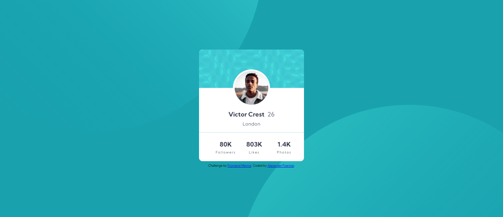

# Frontend Mentor - Profile card component solution

This is a solution to the [Profile card component challenge on Frontend Mentor](https://www.frontendmentor.io/challenges/profile-card-component-cfArpWshJ). Frontend Mentor challenges help you improve your coding skills by building realistic projects. 

## Table of contents

- [Overview](#overview)
  - [The challenge](#the-challenge)
  - [Screenshot](#screenshot)
  - [Links](#links)
- [My process](#my-process)
  - [Built with](#built-with)
  - [What I learned](#what-i-learned)
  - [Continued development](#continued-development)
  - [Useful resources](#useful-resources)
- [Author](#author)
- [Acknowledgments](#acknowledgments)

**Note: Delete this note and update the table of contents based on what sections you keep.**

## Overview

### The challenge

- Build out the project to the designs provided

### Screenshot



### Links

- Solution URL: [My Solution](https://github.com/Chaoticshmoo/profileCardComponent)
- Live Site URL: [My Live Site](https://chaoticshmoo.github.io/profileCardComponent/)

## My process

### Built with

- Semantic HTML5 markup
- CSS custom properties
-CSS variables
- Flexbox
- VSCode
- EMMET
- Chrome dev tools

### What I learned

Even though it was a pain to figure out I've never used multiple images and pieced together a background with them. Seeing that it works at the indicated desktop and mobile views (1440px and 375px) made me happy but I know I have a long way to go and much more to learn. 
```css
body {
    background-color: var(--bg);
    background-image: url("./images/bg-pattern-top.svg"), url("./images/bg-pattern-bottom.svg");
    background-position: -225px -600px, 680px 300px;
    background-repeat: no-repeat, no-repeat;
    background-attachment: fixed;
}
```
I'm proud of this CSS as I haven't really used variables and feel I got them down well so far. 
```css
:root {
    /* Colors */
    --labels: hsl(227, 10%, 46%);
    --mainColor: hsl(229, 23%, 23%);
    --bg: hsl(185, 75%, 39%);
    --shadow: hsl(0, 0%, 59%);
    --content-clr: #fff;
    --bg-transparent: hsla(185, 70%, 38%, 0.3);

    /* Fonts */
    --fs-name-stats: 18px;
    
    /* Misc. */
    --border-rad: 10px;
}
```

### Continued development

I want to understand responsive designs using multiple images for backgrounds as I know the background doesn't scale with other viewing sizes other than the challenges indicated ones. I also want to learn more Flexbox as I had some trouble getting the layout to line up. I kept getting the different Flexbox properties mixed up and didn't know which went where. 

Overall, I want to improve my CSS skills as I enjoy using it as a tool and find making websites to be extreme fun. 

### Useful resources

- [W3 Schools](https://www.w3schools.com/) - This helped me for remembering properties and how they work in CSS. 


## Author

- Website - Alexander Foerster
- Frontend Mentor - [@Chaoticshmoo](https://www.frontendmentor.io/profile/Chaoticshmoo)
- Twitter - [@ChaoticShmoo](https://www.twitter.com/ChaoticShmoo)

